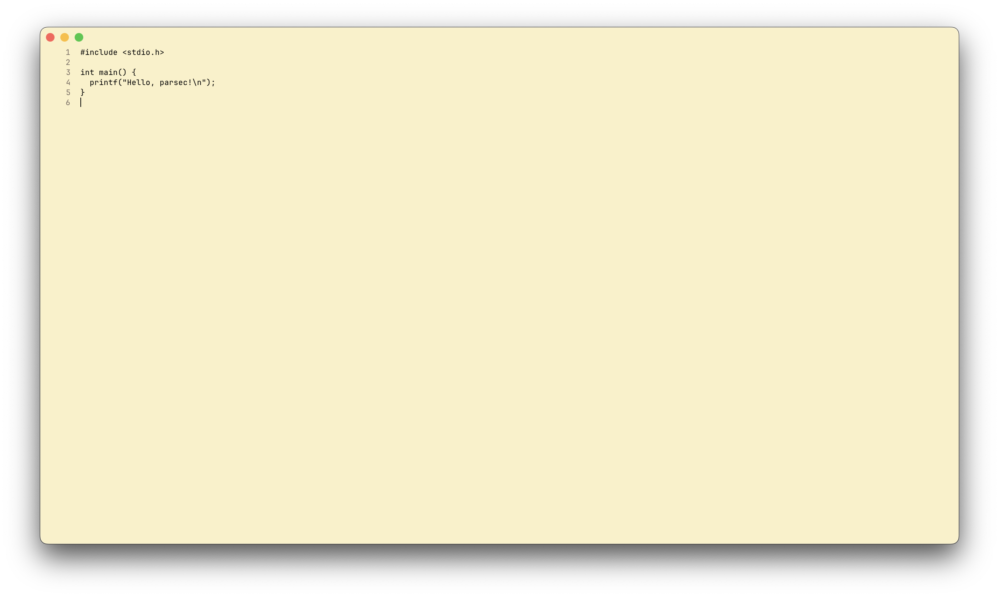

# Parsec

A text editor written in C. Currently supporting macOS.

## Building

Parsec relies on [https://github.com/memononen/fontstash](Font Stash) for caching glyphs in a texture atlas and 
[https://github.com/nicbarker/clay](Clay) for laying out UI elements.

The `Makefile` is already configured to download and extract the necessary files from Font Stah and Clay.
